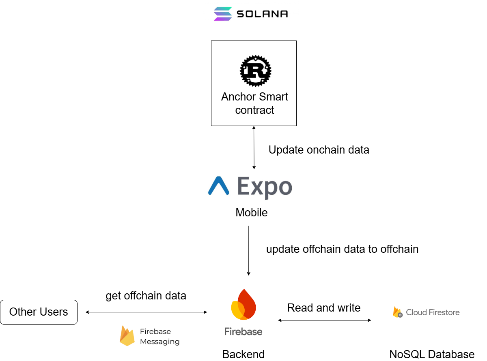

# Chain-Split

一個基於 Solana 區塊鏈的分帳應用，讓使用者透過 Phantom 錢包連接，將帳單記錄儲存在鏈上，實現去中心化的群組費用管理。

> **專案狀態：開發中** - 目前已完成核心區塊鏈合約、移動端架構與後端 API，正在進行 UI/UX 開發。

## 系統架構



系統採用三層架構：
- **Solana 鏈上**：智能合約處理群組、費用記錄與結算
- **Mobile App**：React Native 移動應用提供使用者介面
- **Firebase 鏈下**：儲存輔助數據、處理使用者間通訊與推送通知

## 已完成功能

### ✅ Solana 智能合約 (contract/)
使用 Anchor 框架開發，已部署至 devnet：
- **群組管理**
  - 建立群組 (`create_group`)
  - 成員加入 (`join_group`)
  - 移除成員 (`remove_group_member`)
  - 關閉群組 (`close_group`)

- **費用處理**
  - 建立費用記錄 (`create_expense`)
  - 成員簽署確認 (`sign_expense`)
  - 自動結算檢測
  - 手動結算 (`finalize_expense`)

- **支付功能**
  - USD 鏈下支付標記 (`pay_with_usd`, `confirm_usd`)
  - USDT 鏈上支付 (`pay_with_usdt`)

- **完整測試覆蓋**：所有功能都有端對端測試

### ✅ Mobile App (dapp/)
React Native + Expo 移動應用：
- **錢包整合**
  - Phantom 錢包連接/斷開
  - 加密通訊（使用 NaCl box）
  - 本地會話管理

- **區塊鏈指令封裝**
  - 完整的智能合約調用接口
  - PDA（程序派生地址）計算
  - 交易構建與簽名流程

- **應用架構**
  - 歡迎/主頁面結構 (Expo Router)
  - 移動端響應式佈局
  - 升級至 Expo SDK 54

### ✅ Firebase 後端 (firebase/)
- **Cloud Functions API**：處理鏈下業務邏輯
- **Cloud Firestore**：儲存群組、費用、使用者資料
- **Firebase Messaging**：群組成員間的推送通知
- **Helius Webhook**：監聽 Solana 鏈上事件並同步至 Firestore
- **自動結算**：當所有成員簽署後自動觸發結算

## 技術棧

### 區塊鏈層
- **Solana** - 高效能區塊鏈
- **Anchor Framework** (Rust) - 智能合約框架
- Program ID: `EYR8PHamGh1S1PM7d7txEDzyqfGfnchMbQ6tNHMBBsfX`

### 前端
- **React Native** + **Expo SDK 54**
- **Expo Router** - 檔案系統路由
- **@coral-xyz/anchor@0.28.0** - 唯一支援 React Native 的版本
- **@solana/web3.js** - Solana JavaScript SDK

### 後端
- **Firebase Cloud Functions** (Node.js)
- **Cloud Firestore** - NoSQL 資料庫
- **Firebase Cloud Messaging** - 推送通知
- **Helius** - Solana RPC 與 Webhook 服務

## 專案結構

```
Chain-Split/
├── contract/              # Solana 智能合約
│   ├── programs/
│   │   └── contract/
│   │       ├── src/
│   │       │   ├── lib.rs              # 合約入口
│   │       │   ├── state.rs            # 資料結構定義
│   │       │   └── instructions/       # 指令實作
│   │       │       ├── hoster/         # 主辦人功能
│   │       │       ├── member/         # 成員功能
│   │       │       └── payer/          # 付款人功能
│   ├── tests/             # 合約測試
│   └── target/idl/        # IDL 文件（給前端使用）
│
├── dapp/                  # Expo 移動應用
│   ├── app/               # 頁面（Expo Router）
│   │   ├── index.js       # 主頁
│   │   ├── onConnect.js   # 錢包連接回調
│   │   └── onDisconnect.js
│   ├── components/        # React 元件
│   ├── instruction/       # Solana 指令封裝
│   │   ├── hoster.js      # 主辦人指令
│   │   ├── member.js      # 成員指令
│   │   ├── payer.js       # 付款人指令
│   │   └── utils.js       # PDA 工具
│   ├── services/          # 業務邏輯層
│   ├── utils/             # 工具函數
│   └── idl/               # 智能合約 IDL
│
├── firebase/              # Firebase 後端
│   ├── functions/
│   │   ├── index.js       # Cloud Functions 入口
│   │   └── service/       # API 服務
│   ├── firestore.rules    # 資料庫安全規則
│   └── firestore.indexes.json
│
└── src/                   # 專案資源
    └── chain-split.drawio.png  # 架構圖
```

## 待開發功能

- [ ] UI/UX 完整設計與實作
- [ ] 群組管理介面
- [ ] 費用建立與瀏覽頁面
- [ ] 支付確認流程
- [ ] 即時通知系統整合
- [ ] USDT 支付功能完整實作
- [ ] 主網部署與安全審計

## 開發環境設置

詳細說明請參考：
- [智能合約文檔](./contract/CONTRACT_STRUCTURE.md)
- [DApp 文檔](./dapp/DAPP_STRUCTURE.md)

## License

MIT
